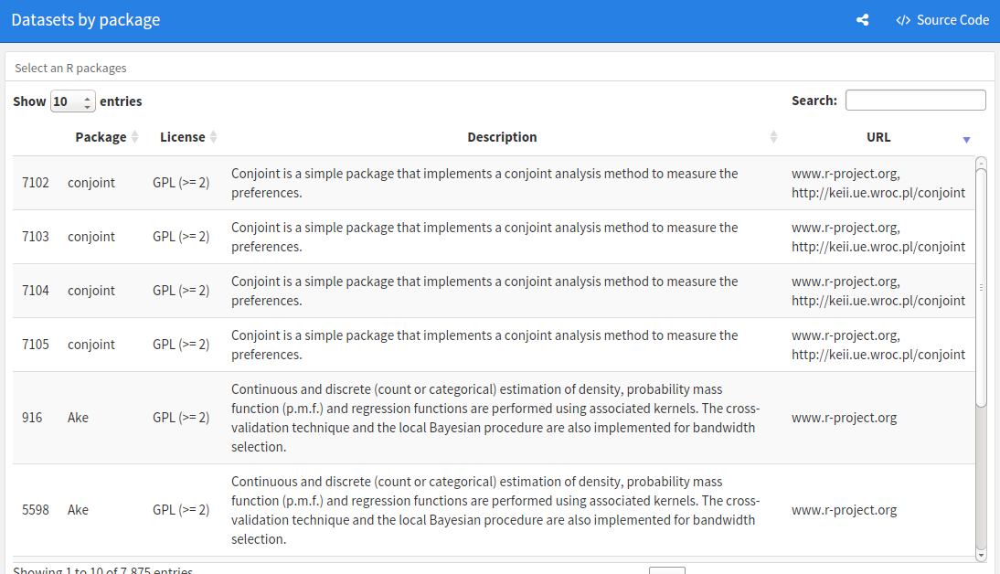
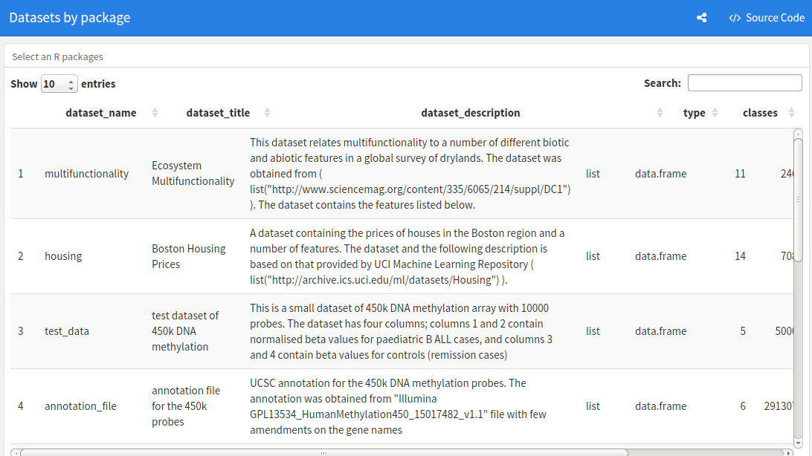
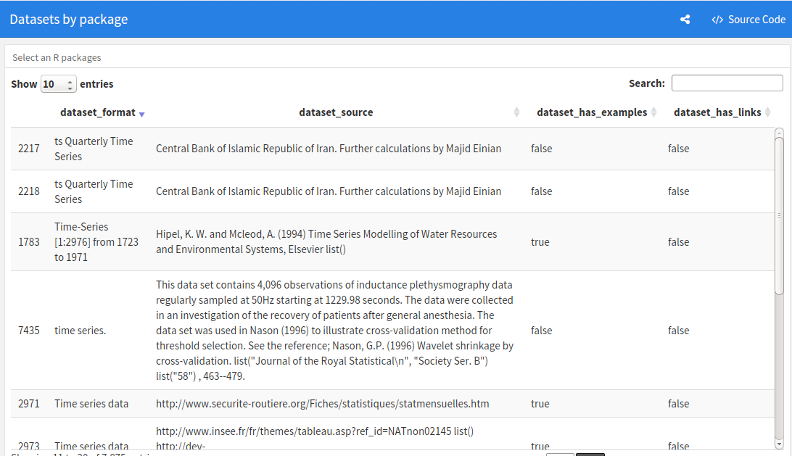
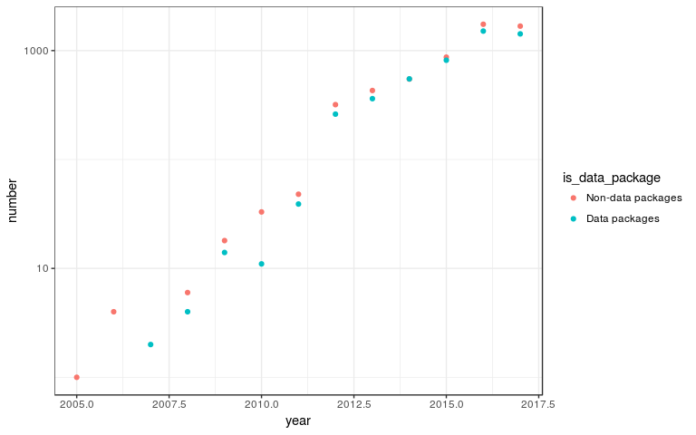

<!-- README.md is generated from README.Rmd. Please edit that file -->
Discovering good data packages
==============================

### Project participants:

-   Andy Teucher (@ateucher)
-   Richie Cotton (@richierocks)
-   Claudia Vitolo (@cvitolo)
-   Jakub Nowosad (@Nowosad)
-   Joe Stachelek (@jsta)

Most of us are involved in teaching R in some way, and it is always a struggle to find suitable datasets with which to teach, especially across domain expertise. There are many packages that have data, but finding them and knowing what is in them is a struggle due to inadequate documentation.

Goals:
------

1.  Make it easy to discover suitable data
2.  Write some guidance on documenting data in packages

Deliverables:
-------------

1.  Google Doc which describes best practices for documentation.

Checklist of things to document.

Make sure your documentation answers as many of these questions as possible.

-   What does the data represent?
-   What format is the data in?
-   How big is the dataset?
-   Where does the come from?
-   How has the data been processed?
-   What does the data look like?
-   How do you analyze the data?
-   Where is this data used?
-   Is there a paper, or other external resource discussing this dataset?

1.  A patch for `usethis::use_readme_rmd()` to display datasets in package README files.

2.  A flexdashboard with a searchable table that shows metadata on datasets from many CRAN packages. It has information for over 4000 datasets.

The state of data on CRAN
-------------------------

-   [List CRAN packages with data](R/get-pkgs-with-data-dir.R)

-   [Parsing DESCRIPTION files](R/parse_description.R)

-   [Parsing Rd files](R/get_metacran.R)

-   *Installing and loading packages*

What makes a good data package?
-------------------------------

<https://docs.google.com/document/d/1xhJmt0v4p49jpwINNak9N7AMMb5yohTwwNOXH8WzqqQ/edit?usp=sharing>

Twitter Bot
-----------

<https://twitter.com/rstatsdata>

Graphs
------

Flashboard
----------

<https://ropenscilabs.github.io/data-packages>

Potential Future Work
---------------------

-   Scoring the quality of data in a package

-   Creating badges to advertise data quality

-   Use Github URLs to pull geo-location of package maintainers

-   Crawl Biocondunctor

-   Examine `inst/extdata` folders
