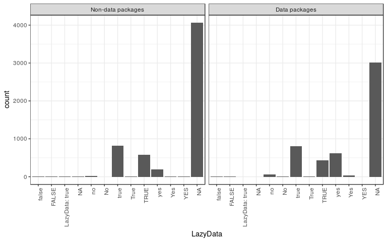
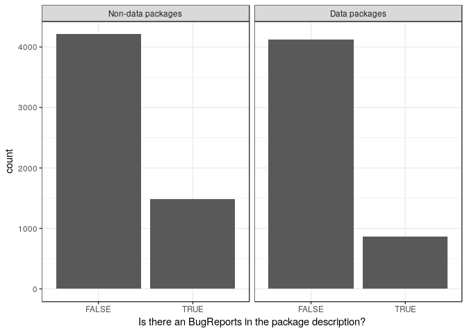
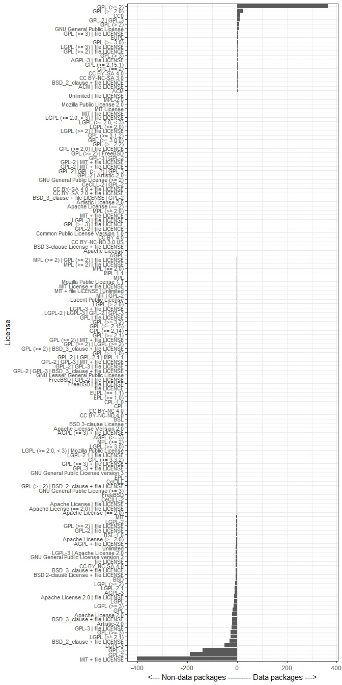
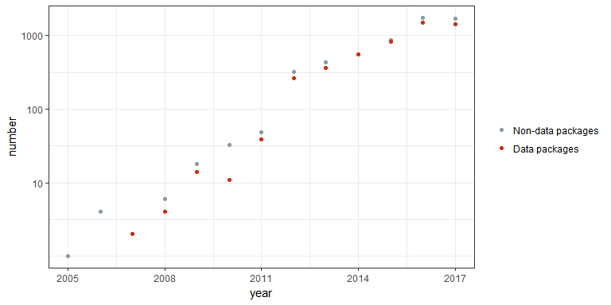

<!-- README.md is generated from README.Rmd. Please edit that file -->
Discovering good data packages
==============================

The state of data on CRAN
-------------------------

-   [List CRAN packages with data](R/get-pkgs-with-data-dir.R)

-   [Parsing DESCRIPTION files](R/parse_description.R)

-   [Parsing Rd files](R/get_metacran.R)

-   *Installing and loading packages*

What makes a good data package?
-------------------------------

<https://docs.google.com/document/d/1xhJmt0v4p49jpwINNak9N7AMMb5yohTwwNOXH8WzqqQ/edit?usp=sharing>

Twitter Bot
-----------

<https://twitter.com/rstatsdata>

Graphs
------

Flashboard
----------

<https://ropenscilabs.github.io/data-packages>

Potential Future Work
---------------------

-   Scoring the quality of data in a package

-   Creating badges to advertise data quality

-   Use Github URLs to pull geo-location of package maintainers

-   Crawl Biocondunctor

-   Examine `inst/extdata` folders
